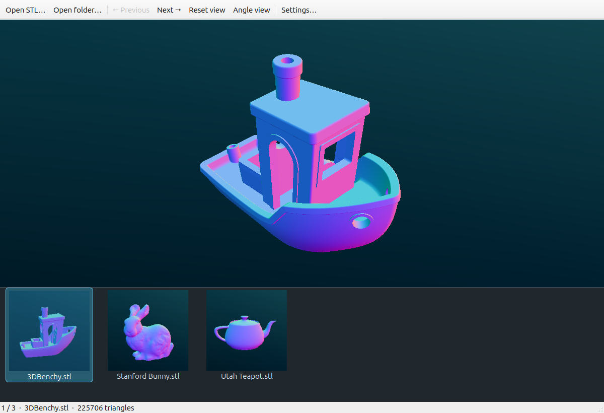
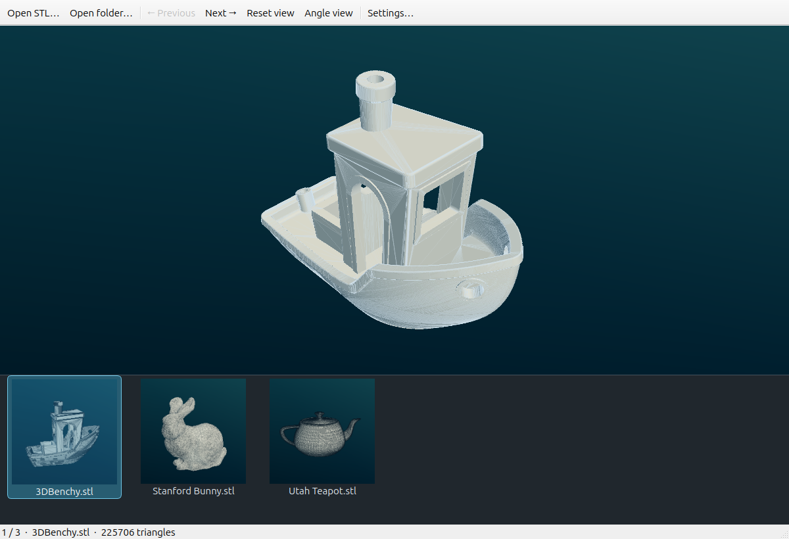
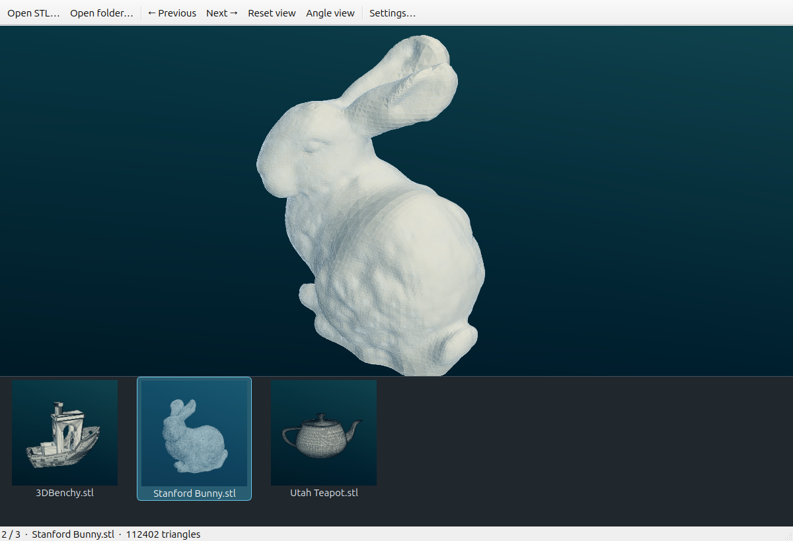
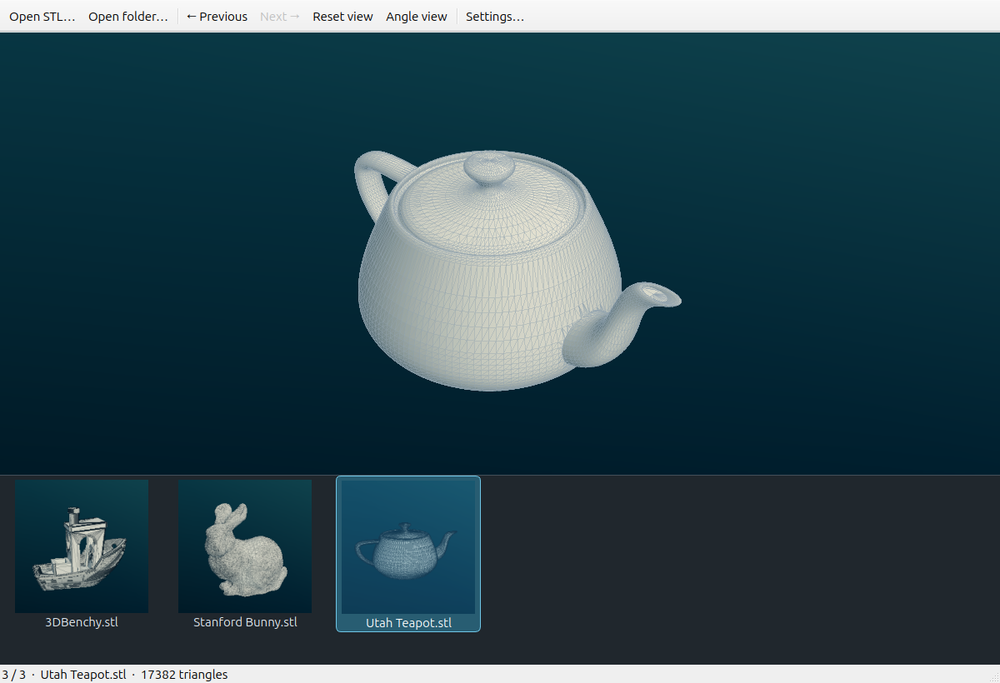
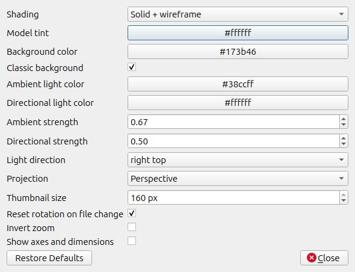

# STL Browser · Linux STL viewer with fstl shading and folder thumbnails

**Browse your STL folder like a photo collection.** A native Linux viewer built
on [fstl](https://github.com/fstl-app/fstl), with a bottom thumbnail strip,
arrow-key browsing, five rendering styles, and settings that explain themselves.

[](https://github.com/JoeMirai/stl-browser/actions/workflows/linux.yml)
[](https://github.com/JoeMirai/stl-browser/releases/latest)
[](LICENSE)

**[Download for Linux](https://github.com/JoeMirai/stl-browser/releases/latest)** ·
[Build from source](#build-from-source) · [Free demo models](#try-the-showcase-models)



*Actual app capture: Surface angle coloring on the free 3DBenchy model.*

## Familiar rendering, easier folder browsing

If you enjoy fstl’s shading and want thumbnails for a whole folder, STL Browser
keeps that renderer and adds a filmstrip beneath the model. It uses C++, Qt
Widgets, and OpenGL, with rendering on demand and lazy thumbnail loading.

- **Browse visually:** clickable previews, Left / Right navigation, natural filename order, and a visible selection.
- **Inspect the mesh:** Classic fstl, Wireframe, Surface angle, Custom lighting, and Solid + wireframe.
- **Get an angled view:** one-click Angle View, plus rotation, pan, zoom, and reset.
- **Make it yours:** model/background colors, light colors and strength, light direction, projection, camera behavior, and thumbnail size.
- **Understand each setting:** hover over a setting or its label for an explanation. Changes save immediately; Restore Defaults starts fresh.

### Solid surfaces with the triangle structure visible



<p>
  
  
</p>

*Benchy, Stanford Bunny, and Utah Teapot. [Model credits and licenses](docs/model-credits.md).*

<details>
<summary>See the settings panel</summary>



</details>

## Download and install

Get the latest **[Linux release](https://github.com/JoeMirai/stl-browser/releases/latest)**.
The x86_64 `.deb` is built on Ubuntu 24.04 and intended for Ubuntu 24.04 or newer:

```sh
sudo apt install ./stl-browser_0.2.0_amd64.deb
stl-browser /path/to/your/STL-folder
```

The `.tar.gz` contains the same dynamically linked binary and desktop files.
It needs glibc 2.39+, Qt 5.15 runtime libraries, and desktop OpenGL. On Ubuntu:

```sh
sudo apt install libqt5widgets5t64 libqt5opengl5t64 libgl1
tar -xzf stl-browser-0.2.0-linux-x86_64.tar.gz
./stl-browser-0.2.0-linux-x86_64/usr/bin/stl-browser /path/to/your/STL-folder
```

For other Linux distributions, use the source build below. Models are optional
and downloaded separately; the app includes no accounts, telemetry, or model uploads.

## Controls

| Action | Control |
| --- | --- |
| Previous / next STL | **← / →** or toolbar buttons |
| Select a model | Click its bottom thumbnail |
| Rotate | Left mouse drag |
| Pan | Right mouse drag |
| Zoom | Mouse wheel |
| Reset / fit view | **Home** |
| Angle View | **I** or toolbar button |
| Open STL | **Ctrl + O** |
| Open a folder | Toolbar or drag-and-drop |

```sh
stl-browser /path/to/model.stl
stl-browser /path/to/folder
```

The viewer lists readable `.stl` / `.STL` files directly inside the folder;
subfolders are not scanned. Corrupt files show an error while navigation stays
available. STL dimensions are raw coordinates because STL does not define units.

## Try the showcase models

Download `showcase-models.zip` from the release, or run:

```sh
python3 scripts/download-demo-models.py
stl-browser "$HOME/Downloads/STL-Browser-showcase"
```

This fetches **3DBenchy**, **Stanford Bunny**, and **Utah Teapot** with checksums.
The model ZIP includes their individual credits and license links. These model
terms are separate from the viewer’s MIT license. See [model credits](docs/model-credits.md).

## Build from source

Ubuntu / Debian:

```sh
sudo apt install git build-essential cmake qtbase5-dev libqt5opengl5-dev libgl-dev python3
git clone https://github.com/JoeMirai/stl-browser.git
cd stl-browser
cmake -S . -B build -DCMAKE_BUILD_TYPE=Release
cmake --build build -j2
./scripts/install-local.sh
```

The local installer writes under `~/.local` and registers a desktop launcher.
Use `./scripts/install-local.sh --make-default` to make it your default STL
viewer; your previous file associations are backed up first.

```sh
ctest --test-dir build --output-on-failure
```

Headless GUI checks: install `xvfb`, then run
`LIBGL_ALWAYS_SOFTWARE=1 xvfb-run -a ctest --test-dir build --output-on-failure`.
GitHub Actions builds, tests, and packages Linux downloads on Ubuntu 24.04.

## Resource use

- Redraws on interaction or changes, with no continuous idle animation.
- One loading worker shared by selected models and visible thumbnails.
- Thumbnail images capped at **32 MiB in memory** and **200 MiB on disk**.
- Offscreen strip icons release their images; transient parsing buffers return to the OS.

A local Ubuntu/GNOME test measured **0% CPU during a five-second idle sample**
and about **171 MiB resident RAM** with a 674,034-triangle model loaded.
Total RAM depends on the model, Qt, and the graphics driver; cache limits are
not an overall RAM cap. [Validation details](docs/validation.md).

Preferences: `~/.config/JoeMirai/stl-browser.conf`.
Thumbnail cache: `~/.cache/JoeMirai/stl-browser/thumbnails` (or XDG equivalents).

## Contributing and credits

Bug reports and small improvements are welcome in
[Issues](https://github.com/JoeMirai/stl-browser/issues) and pull requests. Include
your Linux distribution, graphics driver, and steps to reproduce rendering issues.

MIT; original fstl copyright and notice are preserved in [LICENSE](LICENSE).
fstl was originally written by Matthew Keeter and is maintained by Paul Tsouchlos
and contributors. STL Browser is an independent project based on that work.
The original fstl installation and settings remain separate.
