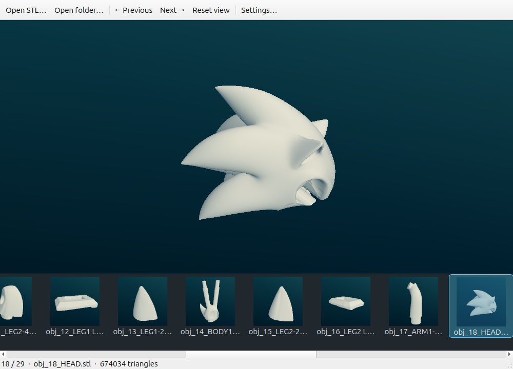

# STL Browser

A lightweight Linux STL viewer with a bottom thumbnail strip, folder navigation,
and configurable shading. Native C++ / Qt Widgets / OpenGL, based on
[fstl](https://github.com/fstl-app/fstl). No browser runtime or background service.



## Use

```sh
stl-browser /path/to/model.stl
stl-browser /path/to/folder
```

- Left / Right arrows or Previous / Next: browse the current folder in natural filename order.
- Click a thumbnail to select a model; scroll the bottom strip to see more files.
- Left drag rotates, right drag pans, and the wheel zooms. Home resets the view.
- Open a file or folder from the toolbar or drag it into the window.
- Settings apply immediately and persist. Hover over each setting or its label for an explanation.

Shading: Classic fstl (default), Wireframe, Surface angle, and Custom lighting.
Customize model tint, background, light colors/strength/direction, projection,
thumbnail size, rotation behavior, zoom direction, and axes. Restore Defaults
resets these preferences. Classic uses the original fstl shader and blue gradient.
Model tint applies to Classic and Custom lighting; lighting controls affect Custom lighting.
STL dimensions are raw coordinates: STL files do not specify physical units.

Only files directly inside the selected folder are shown, including `.STL`.
Unreadable/corrupt files display an error; navigation remains available.

## Build and install (Ubuntu / Debian)

```sh
sudo apt-get install build-essential cmake qtbase5-dev libqt5opengl5-dev libgl-dev
cmake -S . -B build -DCMAKE_BUILD_TYPE=Release
cmake --build build -j2
./scripts/install-local.sh
```

The installer writes under `~/.local` and registers the desktop launcher. To make
it your default STL viewer, use `./scripts/install-local.sh --make-default`.
An existing default association is backed up in the app config folder.

```sh
ctest --test-dir build --output-on-failure
```

GUI tests need a display with desktop OpenGL. On headless Linux:

```sh
sudo apt-get install xvfb
LIBGL_ALWAYS_SOFTWARE=1 xvfb-run -a ctest --test-dir build --output-on-failure
```

## Resource behavior

The viewer redraws on interaction or changes rather than continuously. Selected
model loading and lazy thumbnail loading share a single worker slot. Pending
requests are replaced during rapid navigation; thumbnails load only for the
visible strip and are rendered using a reusable hidden OpenGL framebuffer.
Only the selected model is retained, plus transient thumbnail geometry.

Thumbnail image cache: at most 32 MiB in memory and 200 MiB on disk. Offscreen
strip icons release their pixmaps. Disk keys include path, file size, modification
time, rendering settings, and renderer version. Total RAM also depends on model
size, Qt, and your graphics driver; the thumbnail cap is not a total RAM limit.

Settings: `~/.config/JoeMirai/stl-browser.conf`.
Thumbnails: `~/.cache/JoeMirai/stl-browser/thumbnails` (or XDG equivalents).
No telemetry, model upload, folder-wide preload, or recursive indexing.

## License and provenance

MIT; original fstl copyright and notice are preserved in [LICENSE](LICENSE).
fstl was originally written by Matthew Keeter and is maintained by Paul Tsouchlos
and contributors. This repository retains its Git history; `upstream` points to
fstl. Existing fstl settings and installation remain separate.
